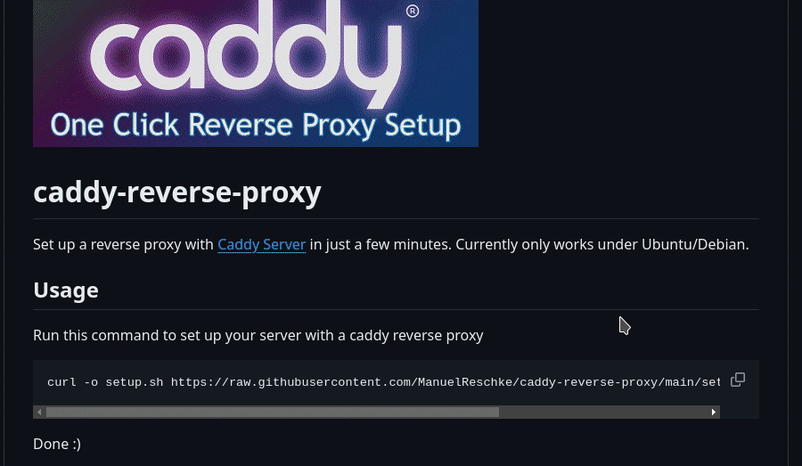

# caddy-reverse-proxy
Set up a reverse proxy with [Caddy Server](https://github.com/caddyserver/caddy) in just a few minutes. Currently only works under Ubuntu/Debian.

## Usage
Run this command to set up your server with a caddy reverse proxy

    curl -o setup.sh https://raw.githubusercontent.com/ManuelReschke/caddy-reverse-proxy/main/setup.sh; chmod +x setup.sh; sudo ./setup.sh

Done :)

## Example Setup

### Setup a reverse proxy on a hetzner VPS for a wordpress site

Server A with IP 88.88.88.88 host a WordPress installation, and we want to access it via server B a reverse proxy.

